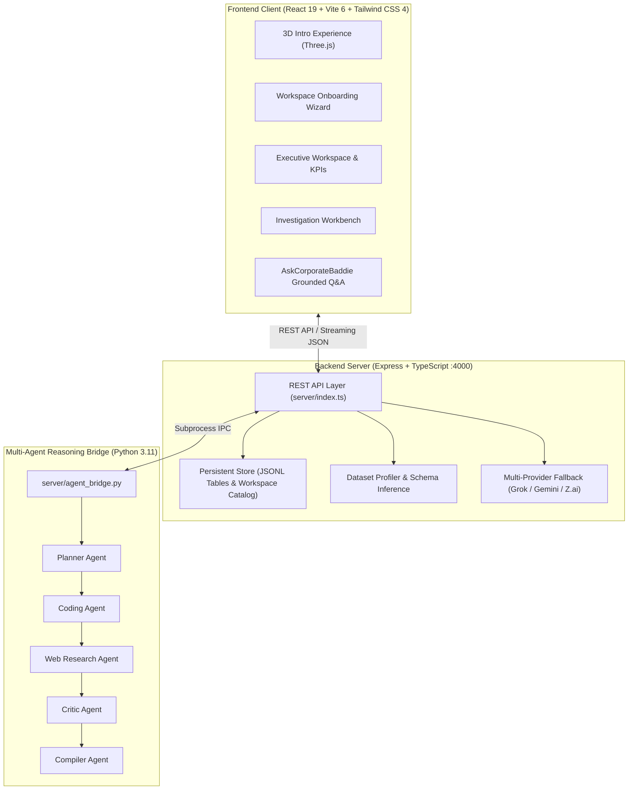

# CorporateBaddie

> **Agentic Decision Intelligence Platform — Evidence Over Eloquence**  
> Turning complex corporate data into defensible strategic decisions through an interactive 3D decision core, Analytica-AI multi-agent reasoning, deterministic evidence verification, and executive intelligence reporting.

---

## Overview

CorporateBaddie bridges the gap between raw business datasets and executive decision-making. Standard generative AI tools often produce plausible-sounding narratives without mathematical grounding or verifiable citations. CorporateBaddie takes the opposite approach: every recommendation, scenario, and risk score is strictly grounded in verified internal datasets, live market telemetry, and tamper-evident audit trails.

The platform combines an interactive Three.js 3D intelligence core with an autonomous multi-agent reasoning pipeline (`Analytica-AI`). If external AI providers become unreachable or API keys are not supplied, CorporateBaddie falls back to deterministic local statistical algorithms so operations never halt.

---

## Key Capabilities

### 1. Interactive 3D Decision Core & Orbital Intelligence
- **Three.js Visual Engine**: Multi-layered icosahedron structure with analytical vertex markers, structural beams, and animated depth layers.
- **Six Orbital Intelligence Nodes**: Visualizes the six continuous dimensions of strategic analysis: Data, Analysis, Market, Evidence, Risk, and Decision.
- **Physics-Based Controls**: Fluid drag-to-rotate interaction with momentum damping, cursor parallax, and smooth camera convergence into the workspace.
- **GPU Resilience**: Built-in recovery from WebGL context loss and automated resource disposal on unmount to eliminate memory leaks.

### 2. Analytica-AI Multi-Agent Reasoning
- **Subprocess Bridge (`server/agent_bridge.py`)**: Connects the Node.js API to the Python Analytica-AI reasoning framework.
- **Specialized Agent Roster**:
  - **Planner Agent**: Breaks complex business questions into quantitative sub-hypotheses.
  - **Coding Agent**: Generates and runs deterministic analytical code directly against local JSONL tables.
  - **Research Agent**: Collects live external benchmarks and market signals via DuckDuckGo.
  - **Critic Agent**: Stress-tests assumptions, checks calculation bounds, and flags conflicting evidence.
  - **Compiler Agent**: Assembles findings into executive summaries, risk breakdowns, and falsification boundaries.

### 3. Resilient Multi-Provider LLM Fallback
- **Tiered Failover Strategy**:
  1. **xAI / Grok** (`grok-4.6`) with live web search capabilities
  2. **Google Gemini** (`gemini-2.5-flash`) via the official `@google/genai` SDK
  3. **Z.ai** (`glm-5`) via OpenAI-compatible API
- **Deterministic Independence**: If external providers fail or credentials are omitted, the local engine computes exact metrics, anomaly bounds, and evidence summaries without dropping data.

### 4. Decision Confidence Engine & Failure Modes
- **Evidence Sufficiency Scoring**: Mathematically derives decision confidence from data coverage, sample size, anomaly density, and source verification. Never inflates scores artificially.
- **Pre-Mortem Failure Analysis**: Evaluates strategic options against catastrophic failure profiles (such as burn rate spikes, customer churn cascades, and compliance risks) with concrete mitigation playbooks.

### 5. Ingestion, Profiling & Auditability
- **Multi-Format Ingestion**: Supports CSV, XLSX, and XLS file formats with automated schema inference, missing value detection, and SHA-256 fingerprinting.
- **Candidate Relationship Detection**: Automatically identifies joinable keys and foreign relationships across workspace datasets.
- **Executive Export**: Generates publication-ready PDF briefs, machine-readable JSON runs, and structured CSV audit logs.

---

## System Architecture



---

## Tech Stack

- **Frontend**: React 19, TypeScript, Vite 6, Tailwind CSS 4, Motion (Framer Motion), Three.js, Lucide Icons, jsPDF
- **Backend**: Node.js, Express, TypeScript, tsx, Multer, XLSX
- **Agent Intelligence**: Python 3.11, Analytica-AI, DuckDuckGo Search, Pandas, NumPy
- **Supported AI Models**: xAI Grok, Google Gemini 2.5 Flash, Z.ai GLM-5
- **Testing & Tooling**: tsx, native Node assertion suites, ESLint, TypeScript compiler

---

## Quick Start

### Prerequisites
- **Node.js**: v20.0.0 or higher
- **npm**: v10.0.0 or higher
- **Python**: v3.11 or higher (optional, required for the Python multi-agent bridge)

### 1. Installation

```bash
git clone https://github.com/trushendarreddy-cell/Corporate-Baddie.git
cd Corporate-Baddie
npm install
```

### 2. Environment Setup

Copy the sample environment file:

```bash
# Windows PowerShell
Copy-Item .env.example .env

# macOS / Linux
cp .env.example .env
```

Configure your preferred API keys in `.env` (the platform functions in deterministic mode even without external keys):

```env
API_PORT=4000
CORS_ORIGIN=http://localhost:3000
DATA_DIR=./server/data
VITE_API_URL=

LLM_PRIMARY=grok
LLM_TIMEOUT_MS=30000

XAI_API_KEY=your_xai_key_here
XAI_MODEL=grok-4.6

GEMINI_API_KEY=your_gemini_key_here
GEMINI_MODEL=gemini-2.5-flash

ZAI_API_KEY=your_zai_key_here
ZAI_MODEL=glm-5
ZAI_BASE_URL=https://api.z.ai/api/paas/v4
```

### 3. Running Locally

To run both backend and frontend concurrently:

```bash
npm run dev:full
```

Or run them in separate terminals:

```bash
# Terminal 1: Backend API (:4000)
npm run api

# Terminal 2: Frontend Client (:3000)
npm run dev
```

Open [http://localhost:3000](http://localhost:3000) in your browser.

---

## REST API Reference

| Method | Endpoint | Description |
| :--- | :--- | :--- |
| `GET` | `/api/health` | Service health status, storage availability, and configured LLM providers |
| `GET` | `/api/ready` | Readiness probe for container orchestration and process managers |
| `GET` | `/api/workspaces` | List all registered workspaces |
| `POST` | `/api/workspaces` | Create a workspace with industry, currency, objectives, and KPIs |
| `GET` | `/api/workspaces/:workspaceId` | Retrieve workspace metadata and attached dataset references |
| `PATCH` | `/api/workspaces/:workspaceId` | Update workspace parameters or strategic objectives |
| `GET` | `/api/workspaces/:workspaceId/datasets` | List all ingested datasets for a given workspace |
| `POST` | `/api/workspaces/:workspaceId/datasets/upload` | Upload and profile CSV, XLSX, or XLS dataset files |
| `GET` | `/api/workspaces/:workspaceId/relationships` | Analyze candidate joins and cross-dataset relationships |
| `GET` | `/api/datasets/:datasetId` | Retrieve detailed column statistics, data types, and preview rows |
| `DELETE` | `/api/datasets/:datasetId` | Delete dataset metadata and clean up stored JSONL tables |
| `POST` | `/api/investigations` | Run a new investigation (triggers deterministic analytics, agents, and LLMs) |
| `GET` | `/api/investigations?workspaceId=...` | List past investigation runs for a workspace |
| `GET` | `/api/investigations/:runId` | Retrieve full investigation output, findings, metrics, and confidence |
| `GET` | `/api/investigations/:runId/evidence` | Inspect verified claims, detected anomalies, trends, and citations |
| `GET` | `/api/investigations/:runId/audit` | View audit trail, tool execution traces, and telemetry |
| `POST` | `/api/ask` | Ask grounded follow-up questions restricted to active evidence |

---

## Repository Structure

```text
Corporate-Baddie/
├── .env.example                # Sample environment template
├── server/                     # Backend API & storage services
│   ├── agent_bridge.py         # Analytica-AI Python multi-agent bridge
│   ├── index.ts                # Express server and route handlers
│   ├── ingest.ts               # File parser, profiler, and SHA-256 hasher
│   ├── llm.ts                  # Multi-provider LLM fallback engine
│   ├── store.ts                # JSONL file store & workspace repository
│   └── data/                   # Local persistence directory
│       ├── corporatebaddie.json# Workspaces and investigation catalog
│       └── tables/             # Stored dataset JSONL tables
├── src/                        # Frontend application source
│   ├── App.tsx                 # Root layout and application view router
│   ├── main.tsx                # Entry point and intro lifecycle controller
│   ├── components/             # React views and interface modules
│   │   ├── DecisionCore3D.tsx  # Interactive 3D intelligence core
│   │   ├── IntroExperience.tsx # Cinematic Three.js intro and onboarding
│   │   ├── DataWorkspace.tsx   # Executive analytics dashboard
│   │   ├── AskCorporateBaddie.tsx # Grounded AI Q&A panel
│   │   ├── WorkspaceCreationPage.tsx # Guided workspace onboarding wizard
│   │   ├── ContextUploadModals.tsx   # File and context ingestion modals
│   │   └── ui/                 # Reusable UI primitives and modules
│   │       ├── CommandHeader.tsx     # Navigation and system status header
│   │       └── InvestigateModule.tsx # Investigation workbench
│   ├── services/               # API client with isomorphic runtime handling
│   ├── state/                  # State management & analytical logic
│   │   ├── confidenceEngine.ts # Evidence sufficiency scoring engine
│   │   ├── failureEngine.ts    # Pre-mortem risk & failure profile engine
│   │   └── executionEngine.ts  # Multi-stage investigation coordinator
│   └── utils/                  # PDF generation, formatting, and audit export
├── scripts/                    # Test suites and development utilities
│   ├── test-execution-engine.ts# Pipeline execution and fallback tests
│   ├── test-confidence-engine.ts# Evidence scoring and penalty tests
│   └── test-failure-engine.ts  # Pre-mortem profile guardrail tests
├── package.json                # Project dependencies and script declarations
└── vite.config.ts              # Vite configuration and Rollup chunk splitting
```

---

## Testing & Quality Assurance

CorporateBaddie includes automated test suites covering pipeline execution, confidence computation, and risk guardrails:

```bash
# Type check the entire codebase
npm run lint

# Run all test suites
npm run test:all

# Run individual test suites
npm test                      # Pipeline execution and deterministic data engine
npm run test:confidence       # Evidence sufficiency and degradation weighting
npm run test:failure          # Failure profiles and pre-mortem guardrails

# Production build and bundle chunk validation
npm run build

# Preview production build locally
npm run preview
```

---

## Governance & Operating Principles

1. **Evidence Over Eloquence**: No recommendation is produced without verifiable quantitative backing.
2. **Deterministic Independence**: If AI models are unavailable, deterministic math and logic still deliver complete data profiles.
3. **No Hallucinated Market Context**: When external market search connectors are inactive, the system explicitly reports `MARKET INTELLIGENCE UNAVAILABLE`.
4. **Transparent Uncertainty**: Gaps in historical depth, missing dimensions, or conflicting signals are explicitly surfaced.
5. **Private Credentials**: `.env` and proprietary data files are strictly protected from git tracking.

---

## Author

**T. Rushendar Reddy**  
AI/ML Engineer & Full-Stack Architect  
Hyderabad, India  
Email: [trushendarreddy@gmail.com](mailto:trushendarreddy@gmail.com)  
GitHub: [@trushendarreddy-cell](https://github.com/trushendarreddy-cell)
