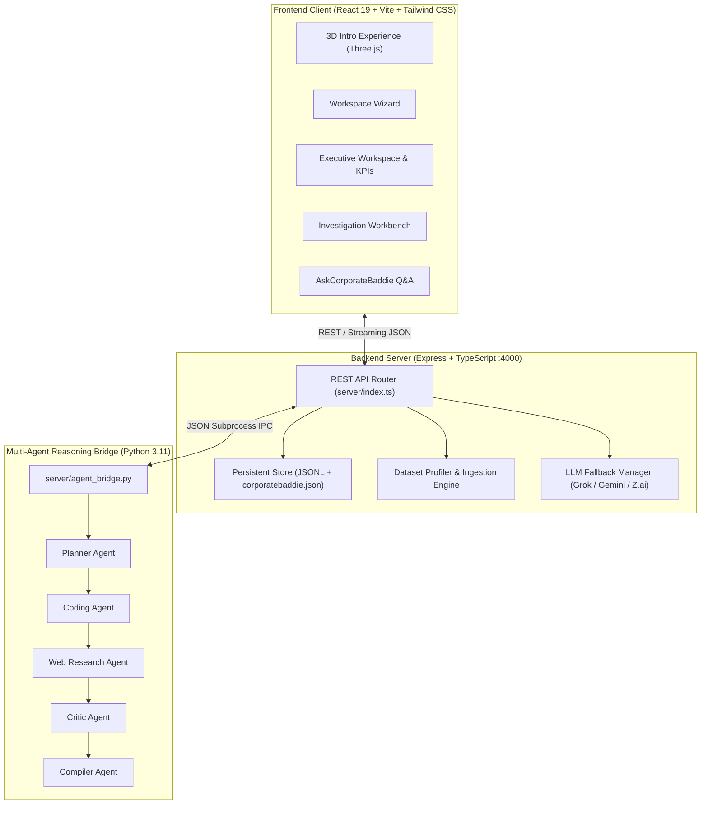

# CorporateBaddie

> **Agentic Decision Intelligence Platform — Evidence Over Eloquence**  
> Making sense of corporate data through an interactive 3D decision core, Analytica-AI multi-agent reasoning, deterministic evidence verification, and executive-ready intelligence.

---

## 🌟 Overview

**CorporateBaddie** transforms raw, chaotic business data into defensible, executive-grade strategic decisions. Unlike traditional chat tools that fabricate narratives, CorporateBaddie pairs deterministic data analytics with an autonomous **multi-agent reasoning engine** (`Analytica-AI`), backed by an interactive Three.js 3D intelligence core.

Every insight, recommendation, and risk score is strictly grounded in verified internal datasets, verifiable market telemetry, and tamper-evident audit trails.

---

## 🚀 Key Features

### 1. 🌐 Immersive 3D Decision Core & Orbital Intelligence
- **Interactive Three.js Sphere**: High-subdivision icosahedron wireframe with dynamic inner analytical layers, pulsing vertex markers, and cardinal structural beams.
- **Orbital Intelligence Satellites**: 5 distinct orbiting intelligence nodes (Financial, Market, Operations, Risk, Compliance) moving in calibrated elliptical orbits.
- **Cinematic Convergence & Drag Controls**: Smooth drag-to-rotate with fluid velocity inertia, hover focus states, and cinematic camera transitions into the workspace.

### 2. 🤖 Analytica-AI Multi-Agent Reasoning Pipeline
- **Python Agent Bridge (`server/agent_bridge.py`)**: Subprocess orchestration connecting the Node.js API to the Analytica-AI multi-agent reasoning framework.
- **Autonomous Agent Roster**:
  - **Planner Agent**: Decomposes complex executive business questions into targeted sub-investigations.
  - **Coding Agent**: Generates and executes deterministic analytical code over local datasets.
  - **DuckDuckGo Research Agent**: Scours live external web sources for market context and competitive signals.
  - **Critic Agent**: Validates claims, stress-tests assumptions, and flags conflicting evidence.
  - **Compiler Agent**: Synthesizes verified findings into executive summaries, risks, and actionable recommendations.

### 3. 🛡️ Resilient Three-Provider LLM Fallback
- **Multi-Provider Priority**: Seamless automatic failover between:
  1. **xAI / Grok** (`grok-4.6` or `qwen/qwen3.8-27b`) with live web search integration
  2. **Google Gemini** (`gemini-2.5-flash`) via `@google/genai`
  3. **Z.ai** (`glm-5`) via standard OpenAI-compatible API
- **Deterministic Independence**: If external providers fail or keys are absent, the system gracefully falls back to deterministic local statistical algorithms without dropping data.

### 4. 📊 Executive Workspace & Live Pipeline Monitoring
- **Real-Time Pipeline Status**: Live status tracking across every agent stage (`Profiling`, `Planning`, `Code Execution`, `Web Verification`, `Synthesis`).
- **Interactive Q&A Assistant (`AskCorporateBaddie`)**: Direct natural-language dialogue grounded exclusively in the current workspace's verified investigation record.
- **Dynamic KPI & Dataset Management**: Multi-format ingestion (CSV, XLSX, XLS), automatic schema profiling, candidate relationship detection, and dataset freshness tracking.

### 5. 🔍 Deterministic Evidence Scoring & Audit Trails
- **Decision Confidence Engine**: Evidence sufficiency calculation based on data coverage, sample size, anomaly density, and source credibility (never fabricated).
- **Tamper-Evident Audit Trails**: SHA-256 dataset fingerprinting, tool execution traces, and audit logs.
- **Executive PDF Export**: One-click generation of branded, publication-ready PDF executive briefs.

---

## 🏗️ Architecture



---

## 💻 Tech Stack

- **Frontend**: React 19, TypeScript, Vite 6, Tailwind CSS 4, Motion (Framer Motion), Three.js, Lucide Icons, jsPDF
- **Backend**: Node.js, Express, TypeScript, tsx, Multer, XLSX parsing
- **Agent Intelligence**: Python 3.11, Analytica-AI, DuckDuckGo Search, Pandas/NumPy
- **AI Models**: xAI Grok, Google Gemini 2.5 Flash, Z.ai GLM-5

---

## ⚡ Quick Start

### Prerequisites
- **Node.js**: v20.0.0 or higher
- **npm**: v10.0.0 or higher
- **Python**: v3.11 or higher (optional, for full Analytica-AI multi-agent bridge)

### 1. Clone & Install

```bash
git clone https://github.com/trushendarreddy-cell/Corporate-Baddie.git
cd Corporate-Baddie
npm install
```

### 2. Configure Environment

Copy the example environment file:

```bash
# Windows PowerShell
Copy-Item .env.example .env

# macOS / Linux
cp .env.example .env
```

Configure your `.env` file with your desired LLM providers (deterministic mode works even without keys):

```env
API_PORT=4000
CORS_ORIGIN=http://localhost:3000
DATA_DIR=./server/data
VITE_API_URL=

LLM_PRIMARY=grok
LLM_TIMEOUT_MS=30000

XAI_API_KEY=your_xai_key_here
XAI_MODEL=grok-4.6

GEMINI_API_KEY=your_gemini_key_here
GEMINI_MODEL=gemini-2.5-flash

ZAI_API_KEY=your_zai_key_here
ZAI_MODEL=glm-5
ZAI_BASE_URL=https://api.z.ai/api/paas/v4
```

### 3. Launch Development Servers

You can run both frontend and backend concurrently:

```bash
npm run dev:full
```

Or run them individually in separate terminals:

```bash
# Terminal 1: Backend API (:4000)
npm run api

# Terminal 2: Frontend Client (:3000)
npm run dev
```

Open [http://localhost:3000](http://localhost:3000) in your browser.

---

## 📡 REST API Reference

| Method | Endpoint | Description |
| :--- | :--- | :--- |
| `GET` | `/api/health` | Health status, storage availability, and configured LLM providers |
| `GET` | `/api/ready` | Readiness probe for container or process managers |
| `GET` | `/api/workspaces` | List all existing business workspaces |
| `POST` | `/api/workspaces` | Create a new workspace with industry, currency, and KPIs |
| `GET` | `/api/workspaces/:workspaceId` | Retrieve workspace details and associated datasets |
| `PATCH` | `/api/workspaces/:workspaceId` | Update workspace metadata and objectives |
| `GET` | `/api/workspaces/:workspaceId/datasets` | List all ingested datasets for a workspace |
| `POST` | `/api/workspaces/:workspaceId/datasets/upload` | Upload and ingest a CSV, XLSX, or XLS dataset |
| `GET` | `/api/workspaces/:workspaceId/relationships` | Detect candidate cross-dataset relationships |
| `GET` | `/api/datasets/:datasetId` | Fetch dataset profile, columns, and sample rows |
| `DELETE` | `/api/datasets/:datasetId` | Remove a dataset and its persisted JSONL records |
| `POST` | `/api/investigations` | Execute an investigation run (triggers Analytica-AI & LLMs) |
| `GET` | `/api/investigations?workspaceId=...` | List historical investigation runs for a workspace |
| `GET` | `/api/investigations/:runId` | Get full investigation output, findings, and metrics |
| `GET` | `/api/investigations/:runId/evidence` | Inspect claims, anomalies, trends, and citations |
| `GET` | `/api/investigations/:runId/audit` | View audit trail, tool execution traces, and telemetry |
| `POST` | `/api/ask` | Ask grounded follow-up questions to CorporateBaddie |

---

## 📂 Project Structure

```text
Corporate-Baddie/
├── .env.example                # Template for environment configuration
├── server/                     # Backend API & data persistence
│   ├── agent_bridge.py         # Analytica-AI Python multi-agent bridge
│   ├── index.ts                # Express server & API endpoints
│   ├── ingest.ts               # File ingestion & schema profiler
│   ├── llm.ts                  # Multi-provider LLM fallback engine
│   ├── store.ts                # JSONL file store & workspace repository
│   └── data/                   # Persisted data directory
│       ├── corporatebaddie.json# Workspaces & investigation metadata
│       └── tables/             # Ingested dataset JSONL tables
├── src/                        # Frontend React application
│   ├── App.tsx                 # Root application shell & view router
│   ├── main.tsx                # React mount entrypoint
│   ├── components/             # UI components & views
│   │   ├── IntroExperience.tsx # Interactive Three.js 3D intro
│   │   ├── DataWorkspace.tsx   # Executive analytics dashboard
│   │   ├── AskCorporateBaddie.tsx # Grounded AI Q&A panel
│   │   ├── WorkspaceCreationPage.tsx # Onboarding wizard
│   │   ├── ContextUploadModals.tsx   # Dataset & context file upload
│   │   └── ui/                 # Reusable UI primitives & modules
│   │       ├── CommandHeader.tsx     # Navigation & provider status
│   │       └── InvestigateModule.tsx # Investigation workbench
│   ├── services/               # Frontend API client
│   ├── state/                  # State management & deterministic engines
│   │   ├── confidenceEngine.ts # Evidence sufficiency scorer
│   │   └── executionEngine.ts  # Multi-agent execution coordinator
│   └── utils/                  # PDF export and formatting utilities
├── scripts/                    # Development & verification scripts
├── package.json                # Dependencies and run scripts
└── vite.config.ts              # Vite bundler & API proxy configuration
```

---

## 🛠️ Verification & Build Commands

```bash
# Type check and linting
npm run lint

# Production build
npm run build

# Preview production build locally
npm run preview
```

---

## 🛡️ Principles & Governance

1. **Evidence Over Eloquence**: No recommendation is produced without verifiable quantitative backing.
2. **Deterministic Independence**: If AI models are unavailable, deterministic math and logic still deliver complete data profiles.
3. **No Hallucinated Market Context**: When external market search connectors are inactive, the system explicitly reports `MARKET INTELLIGENCE UNAVAILABLE`.
4. **Transparent Uncertainty**: Gaps in historical depth, missing dimensions, or conflicting signals are explicitly surfaced.
5. **Private Credentials**: `.env` and proprietary data files are strictly protected from git tracking.

---

## 👤 Author

**T. Rushendar Reddy**  
AI/ML Engineer & Full-Stack Architect  
Hyderabad, India  
Email: [trushendarreddy@gmail.com](mailto:trushendarreddy@gmail.com)  
GitHub: [@trushendarreddy-cell](https://github.com/trushendarreddy-cell)
